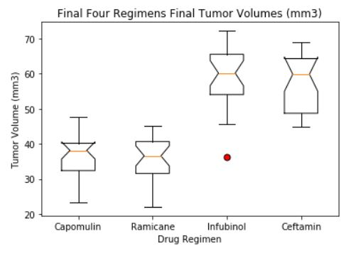
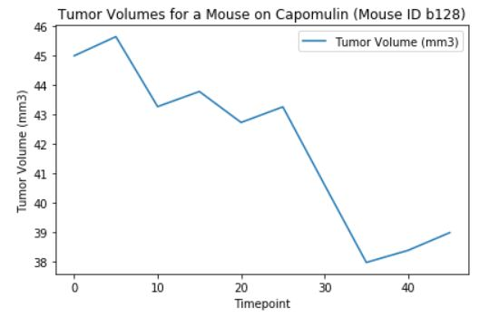
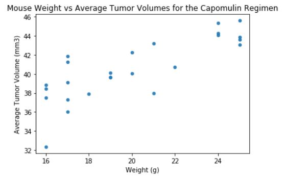
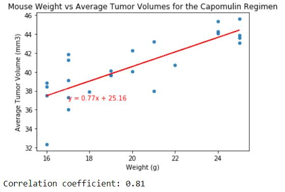

# matplotlib-challenge - The Power of Plots
 Jamie Tan Matplotlib Challenge submission

# Background

What good is data without a good plot to tell the story?

So, let's take what you've learned about Python Matplotlib and apply it to a real-world situation and dataset:

While your data companions rushed off to jobs in finance and government, you remained adamant that science was the way for you. Staying true to your mission, you've joined Pymaceuticals Inc., a burgeoning pharmaceutical company based out of San Diego. Pymaceuticals specializes in anti-cancer pharmaceuticals. In its most recent efforts, it began screening for potential treatments for squamous cell carcinoma (SCC), a commonly occurring form of skin cancer.

As a senior data analyst at the company, you've been given access to the complete data from their most recent animal study. In this study, 249 mice identified with SCC tumor growth were treated through a variety of drug regimens. Over the course of 45 days, tumor development was observed and measured. The purpose of this study was to compare the performance of Pymaceuticals' drug of interest, Capomulin, versus the other treatment regimens. You have been tasked by the executive team to generate all of the tables and figures needed for the technical report of the study. The executive team also has asked for a top-level summary of the study results.

# Analysis

Box plot of the final tumor volume of each mouse across four regimens of interest.

Line plot of time point versus tumor volume for a mouse treated with Capomulin

Scatter plot of mouse weight versus average tumor volume for the Capomulin regimen

Correlation coefficient and linear regression model for mouse weight and average tumor volume for the Capomulin regimen

# Observations & Insights

1. Capomulin and Ramicane are the only drugs that have observable reduction in the mice Tumor Volume after 45 days.

2. There seems to be a strong positive correlation at 0.84 between weight and average tumor volume in mice for the Capomulin and Ramicane regimen.

3. Ramicane seems may be a better choice compared to Capomulin due to the following: a) there is less difference between mean and median b) there is less variation in the data (more predictable outcome) as observed by the lower standard deviation and variance c) the average Metastatic Sites is smaller (1.20 vs 1.28 for Capomulin)
